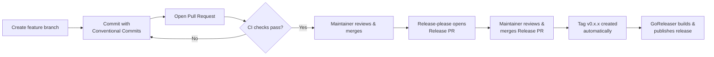

# Contributing to DKVM Manager

Thank you for contributing to DKVM Manager! This guide walks you through
the workflow for developing, testing, and releasing changes.

## Quick Start

```
# 1. Create a feature branch from main
git checkout -b feat/my-feature

# 2. Make changes, then commit using Conventional Commits
git commit -m "feat: add striped LVM support"

# 3. Run tests and verify the build
make test
go vet ./...
go build ./...

# 4. Push and open a Pull Request on GitHub
git push origin feat/my-feature
```

## Developer Workflow

The complete lifecycle of a contribution:



### Step-by-step

1. **Branch** — Create a feature branch from `main`:
   ```
   git checkout -b feat/my-feature
   ```

2. **Commit** — Make your changes and commit using [Conventional Commits](#writing-commit-messages):
   ```
   git commit -m "feat: add striped LVM support"
   ```

3. **Push & Open PR** — Push your branch and open a Pull Request on GitHub.
   The CI workflow runs automatically (`go vet`, `go test -race`, `go build`).
   If any check fails, fix the issues and push again.

4. **Review & Merge** — A maintainer reviews your PR. Once approved and CI
   passes, it is merged into `main`.

5. **Release PR** — The release-please workflow detects the merged Conventional
   Commit and opens a Release PR with an updated `CHANGELOG.md` and version bump.

6. **Release** — A maintainer merges the Release PR, creating a git tag
   (e.g. `v0.1.0`). This triggers GoReleaser to build multi-platform binaries
   and publish them to GitHub Releases.

## Branch Strategy

- All development happens on feature branches based off `main`.
- Open a Pull Request to merge changes into `main`.
- The `main` branch is protected — PRs must pass CI and receive at least one
  review approval before merging.

### Branch Naming (recommended)

| Prefix | Purpose |
|--------|---------|
| `feat/` | New features |
| `fix/` | Bug fixes |
| `docs/` | Documentation changes |
| `refactor/` | Refactoring |
| `ci/` | CI/CD changes |

## Writing Commit Messages

This project follows **Conventional Commits** for automated changelog
generation and version bumping. Format:

```
<type>[optional scope]: <description>

[optional body]

[optional footer(s)]
```

### Types

| Type | Changelog Section | Description |
|------|-------------------|-------------|
| `feat` | Added | New feature |
| `fix` | Fixed | Bug fix |
| `docs` | Changed | Documentation-only changes |
| `refactor` | Changed | Code refactoring (no feature or fix) |
| `perf` | Changed | Performance improvements |
| `style` | — | Code style (formatting, no logic change) |
| `test` | — | Adding or correcting tests |
| `build` | — | Build system or dependency changes |
| `ci` | — | CI/CD configuration changes |
| `chore` | — | Other maintenance tasks |
| `revert` | — | Reverting a previous commit |

### Examples

```
feat: add striped LVM support in configuration dialog
fix: resolve silent failure in OVMF file operations
docs: update README with installation instructions
ci: add GitHub Actions workflow for PR testing
```

## Testing

- **Full test suite:** `make test`
- **Fast feedback (TUI changes):** `make test-short` (skips integration tests)
- **Verify build:** `go vet ./...` && `go build ./...`

## Pull Request Checklist

Before submitting a PR, ensure:

- [ ] Commit messages or PR title follow [Conventional Commits](#writing-commit-messages).
- [ ] Tests pass (`make test`).
- [ ] Code builds without errors (`go build ./...`).
- [ ] Relevant entries added to `[Unreleased]` in `CHANGELOG.md` if needed
      (e.g. breaking changes or notable internal changes not picked up automatically).

## Release Process

DKVM Manager uses automated release tooling powered by **release-please** and
**GoReleaser**.

### Release-please

When commits land on `main`, release-please scans for Conventional Commits and
opens a **Release PR** containing:

- Updated `CHANGELOG.md` entries grouped by type (Added, Fixed, Changed, etc.)
- A version bump in the `VERSION` file
- A proposed git tag for the release

Maintainers review the Release PR, verify changelog accuracy, and merge when
ready.

### GoReleaser

Merging the Release PR creates a version tag (e.g. `v0.1.0`), which triggers
the release workflow to build and publish artifacts:

| Artifact | Platforms | Format |
|----------|-----------|--------|
| Binary | linux/amd64, linux/arm64, darwin/amd64, darwin/arm64, windows/amd64, windows/arm64 | Native executable |
| Archive | All platforms | `.tar.gz` (`.zip` on Windows) |
| Checksums | — | `checksums.txt` (SHA-256) |

Archives include `LICENSE`, `README`, and `CHANGELOG.md`. Configuration lives
in `.goreleaser.yml`.

### Configuration

Release-please commit-to-changelog mapping is defined in
`.release-please-config.json`. Current defaults:

| Commit Type | Changelog Section | Visible? |
|-------------|-------------------|----------|
| `feat` | Added | Yes |
| `fix` | Fixed | Yes |
| `docs` | Changed | Yes |
| `refactor` | Changed | Yes |
| `perf` | Changed | Yes |
| `style` | Changed | Yes |
| `build` | Changed | Yes |
| `ci` | Changed | Yes |
| `revert` | Removed | Yes |
| `chore` | Changed | No |
| `test` | Changed | No |

