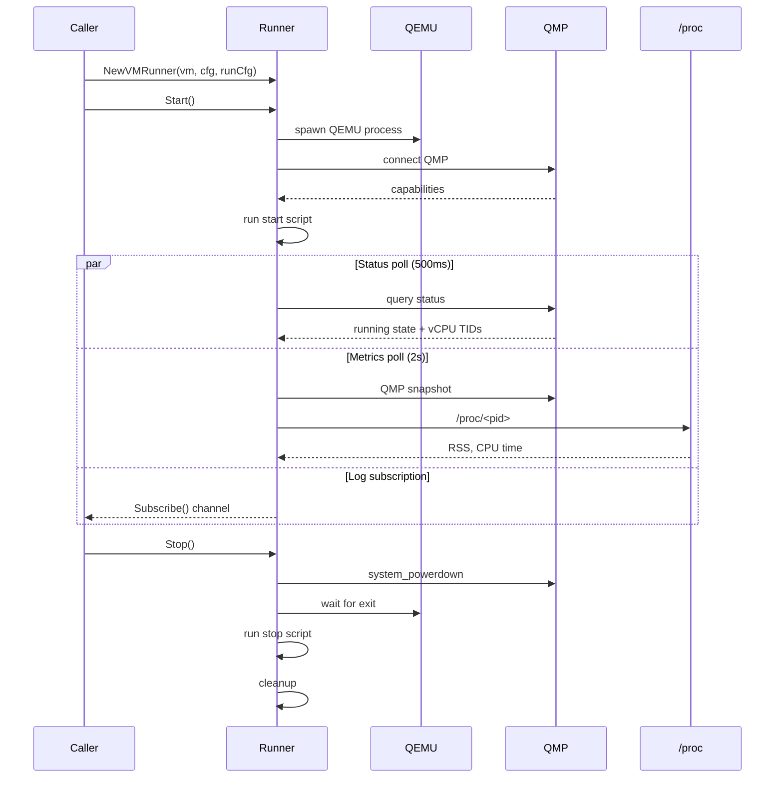
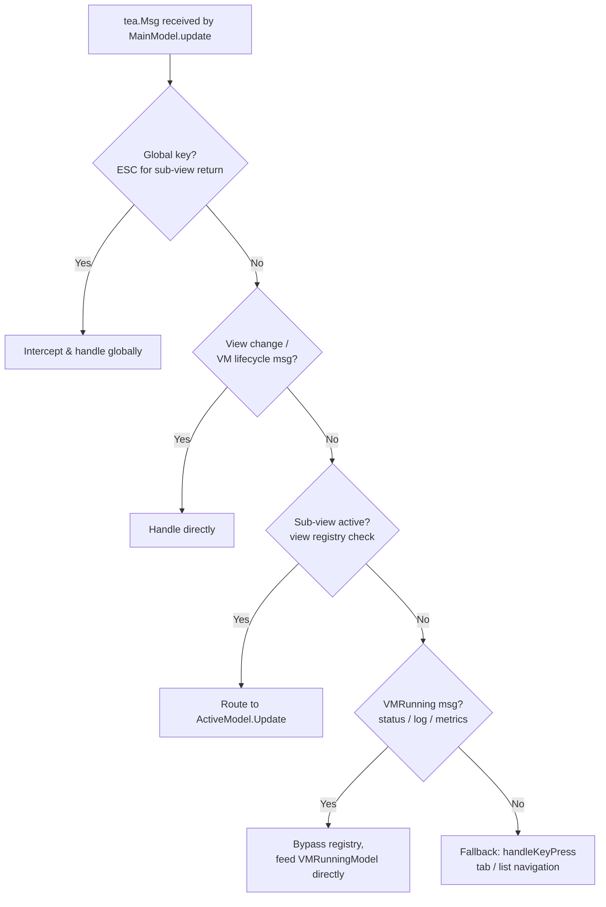

# Architecture

Overview of DKVM Manager's internal architecture. Read `CONTEXT.md` first for domain glossary.

## Package Map

| Package | Purpose |
|---------|---------|
| `internal/vm` | Data plane — runner, QMP client, manager, repository, metrics, proc |
| `internal/tui/models` | View plane — BubbleTea models, forms, key handlers, view registry |
| `internal/tui/components` | Reusable UI components (tabs, status bar, breadcrumbs, dual pane, VM cards/table) |
| `internal/tui/styles` | Lipgloss style definitions |
| `internal/config` | Configuration file loading |
| `internal/domain` | Shared domain types (VM struct) |
| `internal/hugepages` | Hugepage detection and configuration |
| `internal/version` | Version constant |

**Rule**: view plane imports data plane; data plane does NOT import view plane. Runner is the only object crossing in both directions.

### Source references

- `CONTEXT.md` — full glossary
- `internal/vm/manager.go` — VM registry
- `internal/vm/vm_runner.go` — runner implementation
- `internal/tui/models/init.go` — TUI initialization and view registration

---

## Runner Lifecycle

Sequence from create to teardown:



Three poll loops run concurrently on independent cadences:
- **Status** (500ms): QMP binary status + vCPU thread IDs
- **Metrics** (2s): full QMP snapshot (`query-cpus`, `query-blockstats`, `query-balloon`) + `/proc/<pid>`
- **Log**: `Subscribe()` channel streaming stdout, stderr, and script output

### Source references

- `internal/vm/vm_runner.go` — full runner implementation
- `internal/vm/vm_runner_config.go` — RunConfig structure
- `internal/vm/qmp_client.go` — QMP protocol wrapper
- `internal/vm/metrics.go` — metrics snapshot type
- `internal/vm/proc.go` — `/proc` reader

---

### VM startup sequence

When the user selects a VM in the VMs tab and presses Enter:

```
User presses Enter on VM in VMs tab
  → handleVMSelection()
    → creates VMRunner + VMRunningModel
    → view switches to ViewVMRunning
    → tea.Batch(
        vmRunningModel.Init()          // polls with nil runner → [STARTING]
        startVMCommand(runner, ...)     // async goroutine
      )
    → VMStartedMsg (runner now available)
      → tea.Batch(
          seedAndSubscribe()            // seed from persisted log
          waitForVMExit()              // blocks on runner.Done()
          pollStatus()                 // 500ms tick
          initialStatus()              // immediate status query
          pollMetrics()                // 2s tick
        )
    → ... live updates ...
    → user presses q → runner.Stop()
    → VMStoppedMsg → return to main menu
```

### View bypass for VMRunning messages

`VMStatusUpdateMsg`, `VMLogMsg`, and `VMMetricsUpdateMsg` bypass the view
registry dispatch in `update()`. They route directly to
`VMRunningModel.Update()` to avoid the registry's synchronous command
execution pattern, which would break the tick-based polling chain and
blocking channel reads.

> **Source**: `internal/tui/models/key_handlers.go` → `update()` — VMRunning-specific message routing.


## View Registry & Message Flow

The `ViewRegistry` manages sub-view lifecycles. Each TUI form/screen registers as a `ViewDef` with a factory function. The registry handles activation, deactivation, and config menu ordering.

### SubViewModel Interface

Forms implement this interface:

```go
type SubViewModel interface {
    tea.Model                    // Init(), Update(tea.Msg), View()
    SetSize(width, height int)
    FileBrowserActive() bool
}
```

### Message Dispatch Flow



### Source references

- `internal/tui/models/view_registry.go` — registry implementation
- `internal/tui/models/key_handlers.go` — message routing and key dispatch
- `internal/tui/models/types.go` — MainModel struct, View constants
- `internal/tui/models/message_handlers.go` — sub-view message handling

---

### VM Management message flow

1. **Create**: `VMCreateModel` → form validation → `VMCreatedMsg` → `HandleVMCreatedMsg` → `UnifiedViewReturn`
2. **Edit**: `VMEditModel` → form validation → `VMUpdatedMsg` → `HandleVMUpdatedMsg` → `UnifiedViewReturn`
3. **Delete**: `VMDeleteModel` → confirm → `VMDeletedMsg` → `HandleVMDeletedMsg` → `UnifiedViewReturn`
4. **File/Disk selection**: `FileSelectedMsg` / `DiskAddedMsg` → route through `handleSubViewMsg` → `VMFormModel.HandleMessage()`

All create/edit/delete messages go through the `messageHandlers` registry
(registered in `init()`) and return to `ViewConfigMenu` via `UnifiedViewReturn()`.

> **Source**: `internal/tui/models/message_handlers.go` → `HandleVMCreatedMsg()`, `HandleVMUpdatedMsg()`, `HandleVMDeletedMsg()`, `UnifiedViewReturn()`; `internal/tui/models/vm_form.go` → `HandleMessage()`.

### Hardware forms message flow

1. **CPU Topology**: save → `CPUTopologyUpdatedMsg` → handler → `UnifiedViewReturn`
2. **vCPU Pinning**: save → `VCPUPinningUpdatedMsg`; apply kernel → `VCPUCPUKernelAppliedMsg` (async)
3. **CPU Options**: save → `CPUOptionsUpdatedMsg` → handler → `UnifiedViewReturn`
4. **PCI Passthrough**: save → `PCIPassthroughUpdatedMsg`; apply kernel → `PCIVFIOKernelAppliedMsg` (async)
5. **USB Passthrough**: save → `USBPassthroughUpdatedMsg` → handler → `UnifiedViewReturn`

All `*UpdatedMsg` types implement `form.FormSavedMsg` interface for unified
return handling.

> **Source**: `internal/tui/models/message_handlers.go` → respective handler functions.

### Scripts & SSH message flow

1. **Start/Stop Script**: Save → `SaveConfig("custom_script", …)` → `StartStopScriptSavedMsg` → `unifiedViewReturn` → Configuration tab
2. **SSH Password**: Apply → `chpasswd` + `lbu commit` → `SSHPasswordUpdatedMsg` → `unifiedViewReturn` → Configuration tab
3. Both implement `form.FormSavedMsg` interface for the `UnifiedViewReturn` dispatch

> **Source**: `internal/tui/models/start_stop_script.go` → `StartStopScriptSavedMsg`; `internal/tui/models/ssh_password.go` → `SSHPasswordUpdatedMsg`; `internal/tui/models/message_handlers.go` → `UnifiedViewReturn()`.

### Storage message flow

1. **LV Create**: `LVCreateFormModel` validates → `createCmd()` runs `lvcreate` → `LVCreateUpdatedMsg` or `lvCreateErrorMsg` → handled via `form.MessageHandler` interface
2. **Disk Add**: `AddDiskModel` delegates to sub-model (file browser, block device, LVM volume) → sub-model sends `FileSelectedMsg` → `AddDiskModel.handleFileSelected()` → `DiskAddedMsg` → `VMFormModel.HandleMessage()`

> **Source**: `internal/tui/models/lv_create.go`; `internal/tui/models/lv_create_form.go`; `internal/tui/models/disk_add.go`.

### Power & Save message flow

```
User selects Power Off / Reboot / Save changes
  → handleMenuSelection() → handlePowerSelection() / handleConfigMenuSelection()
    → runPowerOff() / runReboot() / runLBUCommit()
      → async command execution (exec.Command)
        → PowerOffMsg / RebootMsg / LBUCommitMsg
          → HandlePowerOffMsg / HandleRebootMsg / HandleLBUCommitMsg
            → statusBar.SetMessage()
```

All three operations return `tea.Model, tea.Cmd` with no view change — the user
stays on the current screen. The status bar provides feedback when the async
message arrives.

> **Source**: `internal/tui/models/key_handlers.go` → `handleMenuSelection()`; `internal/tui/models/message_handlers.go` → handler registry


## Form Framework

The form system (`internal/tui/models/form/`) provides a reusable scrolling form with focus management.

### Components

- **`ScrollableForm`** — wraps a `FormModel`, handles rendering and scroll
- **`FormModel` interface**:

| Method | Purpose |
|--------|---------|
| `BuildPositions() []FocusPos` | Returns navigable positions |
| `CurrentIndex() int` | Current focused position index |
| `SetFocusIndex(int)` | Set focused position |
| `RenderHeader() string` | Form header markup |
| `RenderPosition(FocusPos, bool, int) string` | Single position markup |
| `RenderFooter() string` | Form footer markup |
| `HandleEnter(FocusPos) (FormResult, tea.Cmd)` | Enter key handler |
| `HandleChar(FocusPos, string)` | Character input |
| `HandleBackspace(FocusPos)` | Backspace handler |
| `HandleDelete(FocusPos)` | Delete handler |

- **`FocusPos`** — defines navigable positions: text fields, toggles, buttons, list items, headers
- **`FocusKind`**: `FocusText`, `FocusToggle`, `FocusList`, `FocusButton`, `FocusHeader`, `FocusCustom`

### Source references

- `internal/tui/models/form/form.go` — ScrollableForm
- `internal/tui/models/form/types.go` — FocusPos, FocusKind, FormModel
- `internal/tui/models/form/focus.go` — focus management
- `internal/tui/models/form/keybinds.go` — form keybindings
- `internal/tui/models/form/messages.go` — form messages
- `internal/tui/models/vm_form_model.go` — example FormModel implementation
- `internal/tui/models/vm_form.go` — form interaction handlers

---

### Form model hierarchies

Each form in the TUI follows a consistent pattern: a thin `*Model` struct
wraps `form.ScrollableForm`, and a `*FormModel` struct implements the
`FormModel` interface.

#### VM management forms

```
MainModel
├── ViewVMSelect (VM picker for edit/delete)
├── ViewVMDelete (VMDeleteModel — confirmation dialog)
└── ViewRegistry
    ├── ViewVMCreate (VMCreateModel → ScrollableForm → VMFormModel)
    │   ├── VMFormModel.fileBrowser (FileBrowserModel)
    │   └── VMFormModel.addDiskModel (AddDiskModel)
    │       ├── fileBrowser (FileBrowserModel — FileTypeDiskImage)
    │       ├── blockDevice (BlockDeviceModel)
    │       └── lvmVolume (LVMVolumeModel)
    └── ViewVMEdit (VMEditModel → ScrollableForm → VMFormModel)
        └── (same sub-models as create)
```

#### Hardware forms

```
MainModel
└── ViewRegistry
    ├── ViewCPUTopology (CPUTopologyModel → ScrollableForm → CPUTopologyFormModel)
    ├── ViewVCPUPinning (VCPUPinningModel → ScrollableForm → VCPUPinningFormModel)
    ├── ViewCPUOptions (CPUOptionsModel → ScrollableForm → CPUOptionsFormModel)
    ├── ViewPCIPassthrough (PCIPassthroughModel → ScrollableForm → PCIPassthroughFormModel)
    └── ViewUSBPassthrough (USBPassthroughModel → ScrollableForm → USBPassthroughFormModel)
```

All hardware forms share the `ScrollableForm` framework:
- Thin `*Model` struct wraps `*form.ScrollableForm` and delegates `Init`, `Update`, `View`, `SetSize`
- `*FormModel` implements `form.FormModel` interface
- Focus positions built as `[]form.FocusPos` with kind, label, key, and optional `Data`
- Backward-compatible `Init`/`Update`/`View` methods exist for legacy test support
- Viewports managed internally via `charm.land/bubbles/v2/viewport`

#### Scripts and SSH forms

```
MainModel
└── ViewRegistry
    ├── ViewStartStopScript (StartStopScriptModel → ScrollableForm → StartStopScriptFormModel)
    │   └── fileBrowser (FileBrowserModel) — script path selection
    └── ViewSSHPassword (SSHPasswordModel → ScrollableForm → SSHPasswordFormModel)
```

- `StartStopScriptFormModel` implements `form.FormModel` — dynamic positions (toggle changes field count)
- `SSHPasswordFormModel` implements `form.FormModel` — static positions (three fields: new, confirm, apply)

#### Storage forms

```
MainModel
└── ViewRegistry
    ├── ViewLVCreate (LVCreateModel → ScrollableForm → LVCreateFormModel)
    │   └── (no sub-models; LVCreateFormModel handles everything inline)
    └── ViewVMCreate / ViewVMEdit (VMFormModel)
        └── VMFormModel.addDiskModel (AddDiskModel)
            ├── fileBrowser (FileBrowserModel — FileTypeDiskImage)
            ├── blockDevice (BlockDeviceModel)
            └── lvmVolume (LVMVolumeModel)
```

> **Source**: `internal/tui/models/form/` package; respective `*_form.go` files for each model.

### GRUB configuration integration

Two hardware forms write to GRUB configuration (`/media/usb/boot/grub/grub.cfg`):

| Form | Button | Writes |
|------|--------|--------|
| PCI Passthrough | Apply to Kernel | `vfio-pci.ids=` |
| vCPU Pinning | Apply to Kernel | `isolcpus=`, `nohz_full=`, `rcu_nocbs=` |

Both create `.bak` backup before writing. The GRUB file path is configurable
via `grub_config_path` in the repository config.

> **Source**: `internal/vm/grub_config.go`; `internal/config/config.go` → `GrubConfigPath`.

### Tab navigation

The Power tab is one of three top-level tabs:

| Tab | Purpose |
|-----|---------|
| VMs | List and start VMs |
| Configuration | VM and hardware config, scripts, SSH, storage, save |
| Power | Power off and reboot |

`Tab` cycles through them; each has its own list model (`powerList`, `configList`, `menuList`).

> **Source**: `internal/tui/models/init.go` → `NewMainModelWithConfig()`; `internal/tui/components/tab_model.go`


## Testing Patterns

### Mock HostDiscovery

- `vm.HostDiscovery` is an interface with `ScanCPUTopology()`, `ScanPCIDevices()`, `ScanUSBDevices()`
- Tests provide `MockHostDiscovery` to avoid real hardware access
- **Source**: `internal/vm/discovery.go`

### Dry-Run Mode

- `vm.SetDryRunMode(true)` — runner builds QEMU command but doesn't execute
- `models.SetDryRunMode(true)` — TUI models skip actual operations
- **Source**: `internal/tui/models/init.go` → `SetDryRunMode()`

### Table-Driven Tests

- Standard Go table-driven pattern used throughout
- **Source**: `internal/vm/vm_runner_test.go`, `internal/tui/models/pci_passthrough_form_test.go`

### Test Helpers

- `internal/tui/models/test_helpers_test.go` — shared test utilities (e.g., `sendRunes`, `sendKeys`)
- `internal/tui/models/main_test.go` — MainModel test setup

### Running Tests

```bash
make test          # full suite via Docker
make test-short    # skip integration tests
```

---

## Build

```bash
make build         # via Docker (golang:1.26-alpine)
```

---

## See Also

- [CONTEXT.md](../../CONTEXT.md) — domain glossary
- [CONTRIBUTING.md](../../CONTRIBUTING.md) — contribution workflow
- [ADR 0001: Runner owns the running-VM data plane](../adr/0001-runner-owned-running-vm-data-plane.md) — key architectural decision
- [Charmbracelet v2 Migration Audit](../charmbracelet-v2-migration-audit.md) — detailed API change checklist for BubbleTea v1→v2 migration
