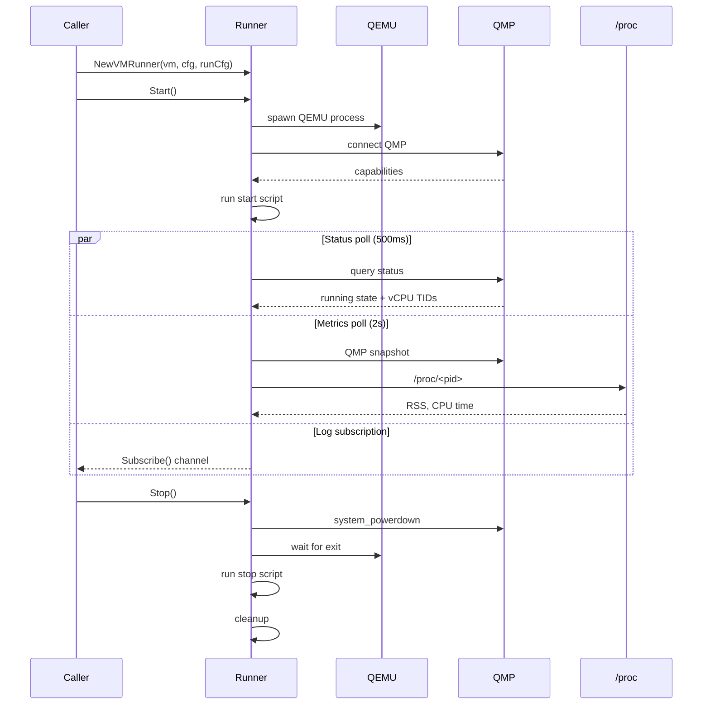
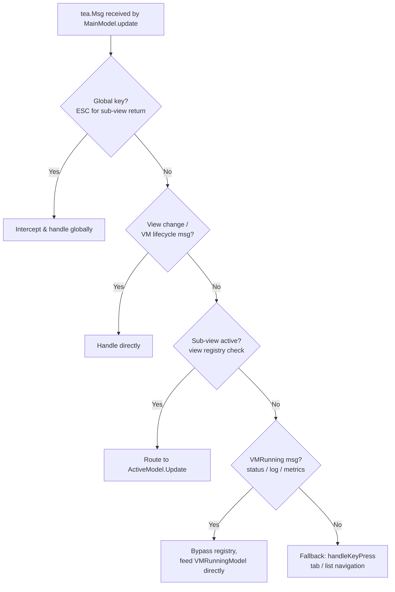

# Architecture

Overview of DKVM Manager's internal architecture. Read `CONTEXT.md` first for domain glossary.

## Package Map

| Package | Purpose |
|---------|---------|
| `internal/vm` | Data plane — runner, QMP client, manager, repository, metrics, proc |
| `internal/tui/models` | View plane — BubbleTea models, forms, key handlers, view registry |
| `internal/tui/components` | Reusable UI components (tabs, status bar, breadcrumbs, dual pane, VM cards/table) |
| `internal/tui/styles` | Lipgloss style definitions |
| `internal/config` | Configuration file loading |
| `internal/models` | Shared domain types (VM struct) |
| `internal/hugepages` | Hugepage detection and configuration |
| `internal/version` | Version constant |

**Rule**: view plane imports data plane; data plane does NOT import view plane. Runner is the only object crossing in both directions.

### Source references

- `CONTEXT.md` — full glossary
- `internal/vm/manager.go` — VM registry
- `internal/vm/vm_runner.go` — runner implementation
- `internal/tui/models/init.go` — TUI initialization and view registration

---

## Runner Lifecycle

Sequence from create to teardown:



Three poll loops run concurrently on independent cadences:
- **Status** (500ms): QMP binary status + vCPU thread IDs
- **Metrics** (2s): full QMP snapshot (`query-cpus`, `query-blockstats`, `query-balloon`) + `/proc/<pid>`
- **Log**: `Subscribe()` channel streaming stdout, stderr, and script output

### Source references

- `internal/vm/vm_runner.go` — full runner implementation
- `internal/vm/vm_runner_config.go` — RunConfig structure
- `internal/vm/qmp_client.go` — QMP protocol wrapper
- `internal/vm/metrics.go` — metrics snapshot type
- `internal/vm/proc.go` — `/proc` reader

---

## View Registry & Message Flow

The `ViewRegistry` manages sub-view lifecycles. Each TUI form/screen registers as a `ViewDef` with a factory function. The registry handles activation, deactivation, and config menu ordering.

### SubViewModel Interface

Forms implement this interface:

```go
type SubViewModel interface {
    tea.Model                    // Init(), Update(tea.Msg), View()
    SetSize(width, height int)
    FileBrowserActive() bool
}
```

### Message Dispatch Flow



### Source references

- `internal/tui/models/view_registry.go` — registry implementation
- `internal/tui/models/key_handlers.go` — message routing and key dispatch
- `internal/tui/models/types.go` — MainModel struct, View constants
- `internal/tui/models/message_handlers.go` — sub-view message handling

---

## Form Framework

The form system (`internal/tui/models/form/`) provides a reusable scrolling form with focus management.

### Components

- **`ScrollableForm`** — wraps a `FormModel`, handles rendering and scroll
- **`FormModel` interface**:

| Method | Purpose |
|--------|---------|
| `BuildPositions() []FocusPos` | Returns navigable positions |
| `CurrentIndex() int` | Current focused position index |
| `SetFocusIndex(int)` | Set focused position |
| `RenderHeader() string` | Form header markup |
| `RenderPosition(FocusPos, bool, int) string` | Single position markup |
| `RenderFooter() string` | Form footer markup |
| `HandleEnter(FocusPos) (FormResult, tea.Cmd)` | Enter key handler |
| `HandleChar(FocusPos, string)` | Character input |
| `HandleBackspace(FocusPos)` | Backspace handler |
| `HandleDelete(FocusPos)` | Delete handler |

- **`FocusPos`** — defines navigable positions: text fields, toggles, buttons, list items, headers
- **`FocusKind`**: `FocusText`, `FocusToggle`, `FocusList`, `FocusButton`, `FocusHeader`, `FocusCustom`

### Source references

- `internal/tui/models/form/form.go` — ScrollableForm
- `internal/tui/models/form/types.go` — FocusPos, FocusKind, FormModel
- `internal/tui/models/form/focus.go` — focus management
- `internal/tui/models/form/keybinds.go` — form keybindings
- `internal/tui/models/form/messages.go` — form messages
- `internal/tui/models/vm_form_model.go` — example FormModel implementation
- `internal/tui/models/vm_form.go` — form interaction handlers

---

## Testing Patterns

### Mock HostDiscovery

- `vm.HostDiscovery` is an interface with `ScanCPUTopology()`, `ScanPCIDevices()`, `ScanUSBDevices()`
- Tests provide `MockHostDiscovery` to avoid real hardware access
- **Source**: `internal/vm/discovery.go`

### Dry-Run Mode

- `vm.SetDryRunMode(true)` — runner builds QEMU command but doesn't execute
- `models.SetDryRunMode(true)` — TUI models skip actual operations
- **Source**: `internal/tui/models/init.go` → `SetDryRunMode()`

### Table-Driven Tests

- Standard Go table-driven pattern used throughout
- **Source**: `internal/vm/vm_runner_test.go`, `internal/tui/models/pci_passthrough_form_test.go`

### Test Helpers

- `internal/tui/models/test_helpers_test.go` — shared test utilities (e.g., `sendRunes`, `sendKeys`)
- `internal/tui/models/main_test.go` — MainModel test setup

### Running Tests

```bash
make test          # full suite via Docker
make test-short    # skip integration tests
```

---

## Build

```bash
make build         # via Docker (golang:1.26-alpine)
```

---

## See Also

- [CONTEXT.md](../../CONTEXT.md) — domain glossary
- [CONTRIBUTING.md](../../CONTRIBUTING.md) — contribution workflow
- [ADR 0001: Runner owns the running-VM data plane](../adr/0001-runner-owned-running-vm-data-plane.md) — key architectural decision
